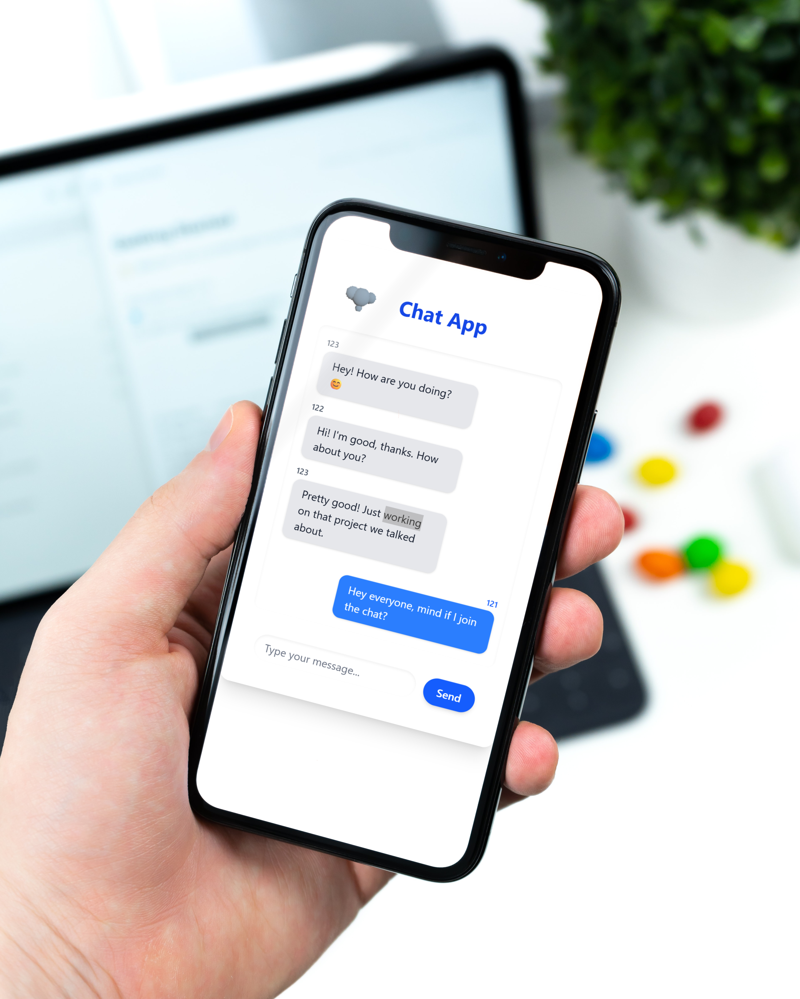

# Chat-app

A modern React-based chat application supporting multi-user conversations with real-time messaging via WebSockets.


For generating device mockups of screenshots [MockDrop](https://mockdrop.io/) was used

---

## Table of Contents

- [Overview](#overview)
- [Features](#features)
- [Tech Stack](#tech-stack)
- [Getting Started](#getting-started)
- [Usage](#usage)
- [Development](#development)
- [Configuration](#configuration)
- [Author](#author)

---

## Overview

**Chat-app** is a lightweight, real-time chat application built with React, Redux, and WebSocket communication.

This project is designed as a technical demo and follows a **monorepo architecture** to organize both frontend and backend code within a single repository.

---

## Features

- Real-time messaging via WebSocket using JSON-RPC protocol for structured communication
- Node.js backend with Express handling HTTP requests and WebSocket connections
- Real-time bidirectional chat powered by Socket.IO
- Distinct message display styles based on user ID for one-to-many communication
- Responsive UI built with React functional components and hooks
- TypeScript for type safety and maintainability
- Clean separation of frontend and backend concerns for easier development and scalability

---

## Tech Stack

- **Frontend:** React, TypeScript, Redux Toolkit, Tailwind CSS
- - **3D Visualization:** Integrated a 3D icon using Three.js
- **WebSocket:** Socket.IO for real-time communication
- **Backend:** Node.js with Express, handling JSON-RPC requests for real-time chat
- **Build Tools:** Vite
- **Linting & Formatting:** ESLint, Prettier

---

## Getting Started

### Prerequisites

- Node.js (>= 16.x recommended)
- npm package manager

### Installation

1. Install FE dependencies:
   ```bash
   cd apps/fronted
   npm install
   ```

2. Install BE dependencies:
   ```bash
   cd apps/backend
   npm install
   ```

3. Start the backend server:
   ```bash
   cd apps/backend
   npm run dev
   ```

4. Start the development server:
   ```bash
   cd apps/fronted
   npm run dev
   ```

5. Open [http://localhost:5173](http://localhost:5173) in your browser.

---

## Usage

- Enter your message in the input box and press Enter or click the Send button.
- Messages from the current user are aligned on the right; messages from other users appear on the left with different styling.
- User ID is currently hardcoded for demo purposes.

---

## Development

### FE folder Structure

- `/src/components` — React components
- `/src/store` — Redux slices and store configuration
- `/src/hooks` — Custom React hooks
- `/src/features` — Feature-based modules (e.g., chat)
- `/public` — Static assets

### Linting

```bash
npm run lint
```

---

## Configuration

- **WebSocket endpoint:** Modify the socket URL in `apps/frontend/src/api/socket.ts`
- **Environment Variables:** Use a `.env` file located in the **apps/backend** folder to configure backend-specific settings such as the WebSocket server URL, ports, and secrets.  
  
- Example `.env` variables:

```bash
PORT=3001
CORS_ORIGIN=http://localhost:3000,http://localhost:5173
```
---

## Author

Nataliia Podpriatova
